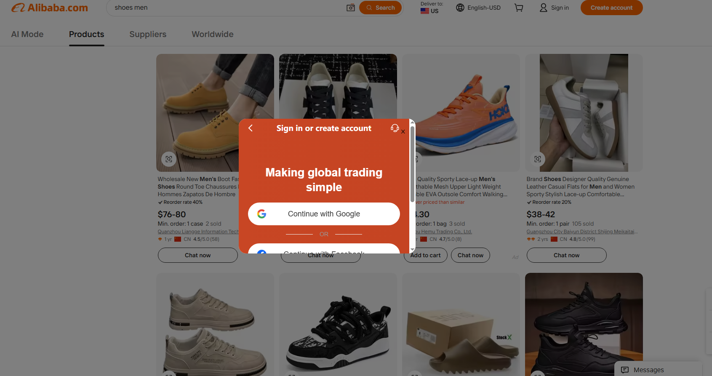
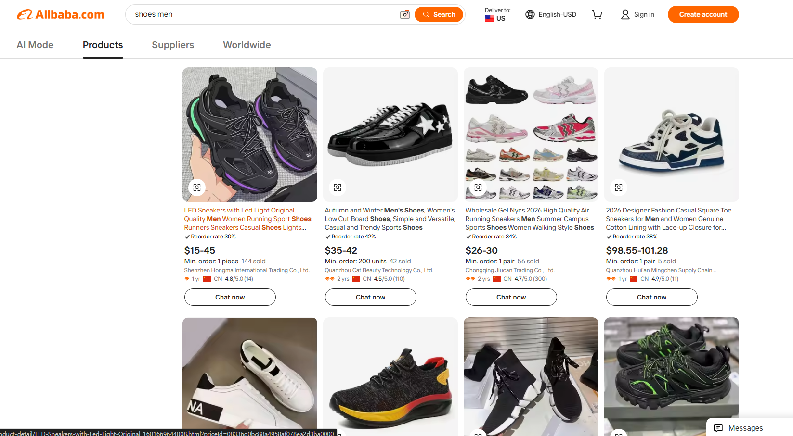

# Ali Search Unlock

一款轻量级 Chrome 扩展 / 油猴脚本，用于移除 `alibaba.com` / `aliexpress.com` **搜索/列表页**上的强制登录弹窗（"Sign in or create account" / baxia 风控登录 iframe），并恢复页面滚动。

## 效果对比

| 使用前（弹窗遮挡） | 使用后（弹窗移除，可正常浏览） |
|---|---|
|  |  |

---

## 两种使用方式

### 方式一：Chrome 扩展（推荐，功能完整）

1. 下载 [最新 Release](https://github.com/Project2er0/alibaba-no-login-popup/releases/latest) 中的 `alibaba-no-login-popup-v1.0.0.zip`
2. 解压后得到 `alibaba-no-login-popup/` 文件夹
3. Chrome 打开 `chrome://extensions`，开启**开发者模式**
4. 点击**加载已解压的扩展程序**，选择该文件夹
5. 工具栏出现图标即安装成功

扩展版优势：
- 支持 `all_frames`，可覆盖 iframe 内的弹窗
- 带工具栏开关 UI，一键启用/禁用
- `MutationObserver` 持续监听 SPA 动态渲染

### 方式二：油猴脚本（Tampermonkey，免安装扩展）

1. 安装 [Tampermonkey](https://www.tampermonkey.net/) 扩展
2. 下载仓库中的 [`ali-search-unlock.user.js`](ali-search-unlock.user.js)
3. 双击文件或拖拽到浏览器，点击「安装」
4. 访问 Alibaba/AliExpress 搜索页即可生效

脚本版特点：
- 无需加载扩展文件夹，安装更轻量
- 油猴菜单支持一键开关（点击 Tampermonkey 图标 → Ali Search Unlock）
- CSS 和 JS 合并为单文件，通过 `GM_addStyle` 注入样式

> ⚠️ 脚本版默认不注入 iframe，baxia 风控弹窗通过顶层 DOM 选择器隐藏，**大部分场景等效于扩展版**。如遇到 baxia iframe 内嵌渲染无法覆盖的情况，请使用扩展版。

---

## 文件结构

```
alibaba-no-login-popup/
├── manifest.json              # MV3 扩展配置
├── content.js                 # 内容脚本：识别并移除弹窗
├── content.css                # 兜底样式：先隐藏已知容器
├── popup.html / popup.js      # 工具栏弹窗 UI（扩展版）
├── ali-search-unlock.user.js  # 油猴脚本（单文件版）
├── icon.png                   # 扩展图标
├── screenshots/               # 效果图
│   ├── before.png             # 弹窗遮挡
│   └── after.png              # 弹窗移除后
└── README.md
```

---

## 自定义

- 新增弹窗类名：编辑 `content.css` 顶部选择器和 `content.js` 里的 `POPUP_CLASS_RE`
- 新增登录文案：编辑 `content.js` 里的 `LOGIN_TEXT` 正则
- 默认关闭：将 `content.js` 顶部 `let enabled = true` 改为 `false`

---

## 能解决 vs 不能解决

本工具只在**浏览器端**移除已经加载到 DOM 的弹窗，不修改 cookie、不拦截请求、不绕过服务端鉴权。

### ✅ 能解决

- 搜索页 / 列表页 / 首页 的"打扰式"登录提示框（不影响数据本身）
- baxia 风控登录 iframe（`iframe#baxia-dialog-content`）的遮挡
- 弹窗导致的 `body { overflow: hidden }` 无法滚动问题

### ❌ 不能解决：阿里服务端硬性鉴权

部分商品详情页，阿里在**服务端**直接对未登录请求返回 302 重定向到：

```
https://login.alibaba.com/newlogin/icbuLogin.htm?return_url=...
```

这种情况下浏览器根本拿不到详情页 HTML，**任何客户端工具都无法处理**。

**验证方法：**
1. 复制干净的商品 URL（去掉 query 参数）
2. 正常窗口粘贴回车 → 若被踢到 login
3. 无痕窗口再试 → 若仍被踢到 login

两次都跳转即为服务端鉴权，可行方案：

| 方案 | 说明 |
|---|---|
| **登录账号**（最推荐） | 登录后服务端不再拦截 |
| Google 网页快照 | 搜 `site:alibaba.com "关键词"`，点结果旁的快照 |
| Archive.org | `https://web.archive.org/web/*/alibaba.com/product-detail/*关键词*` |
| 官方 API / 第三方工具 | 批量选品请用阿里 OpenAPI 或 Jungle Scout 类工具 |

> ⚠️ 不建议用复杂手段"骗"阿里：服务端拦截不受 cookie / referer / URL 影响，反而可能触发更严格风控。

---

## License

MIT
